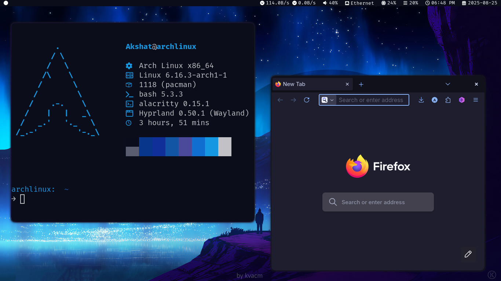
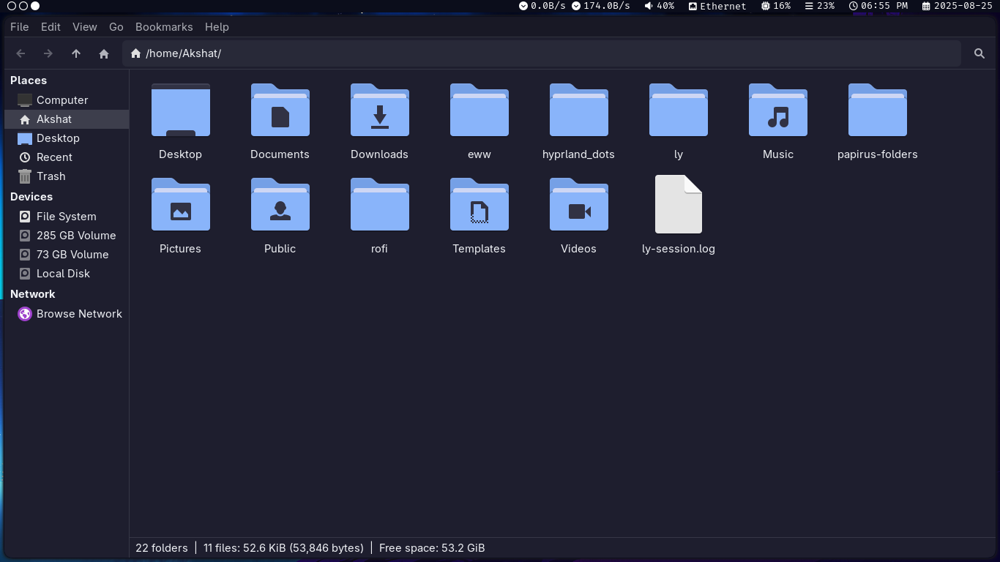
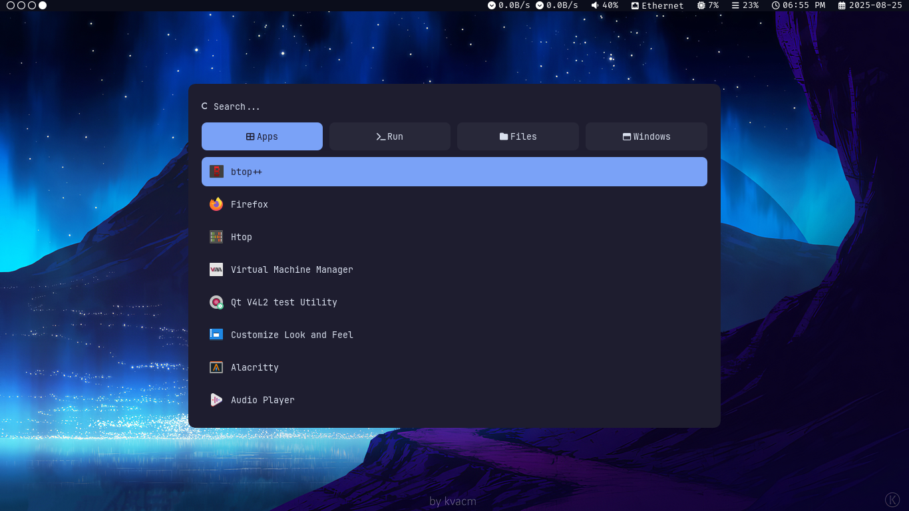

# My Hyprland Dotfiles for Hyprland

A personal collection of configuration files and setup scripts for my Arch Linux.
Primarily tested with **Hyprland**, but many configs (e.g. Neovim, Alacritty, bash) are desktop-agnostic.
The Hyprland RICE is a mix of Catppuccin Mocha and other Catppuccin themes.

## Screenshots








---

## Features

* **Window Managers / DE**

  * [Hyprland](https://github.com/hyprwm/Hyprland)
  * XFCE4 (fallback environment)

* **Terminal & Shell**

  * [Alacritty](https://github.com/alacritty/alacritty)
  * `.bashrc` customizations
  * [Fastfetch](https://github.com/fastfetch-cli/fastfetch)

* **Fonts used**

   * FiraCode Nerd Font(AUR)

* **System Utilities**

  * [btop](https://github.com/aristocratos/btop)
  * [htop](https://htop.dev/)
  * PulseAudio & pavucontrol configs
  * User directories & autostart scripts

* **UI Components**

  * [waybar](https://github.com/Alexays/Waybar)
  * [rofi](https://github.com/davatorium/rofi)
  * Swww for wallpaper
  * Pywal used for generating colors
  * GTK theme configuration

* **Editor**

  * Neovim with NvChad

* **Other**

  * Thunar file manager
  * Papirus icon pack with Catppuccin Mocha Blue flavor
  * Backgrounds and theme tweaks

---

## Installation

Clone this repository:

```bash
git clone https://github.com/akshatm1/Dotfiles.git ~/
```

### Dependencies

Make sure the following packages (or their equivalents) are installed on your system:

* **Core**: yay, git, bash, curl, wget, unzip
* **Desktop**: hyprland, waybar, rofi, thunar, pavucontrol, pulseaudio, NetworkManager
* **Terminal**: alacritty, neovim, btop, htop, fastfetch
* **Extras**: windscribe, git, gh (GitHub CLI)

> Note: package names may vary depending on your distro. Adjust accordingly.

### Applying Configs

The caveman approach I use is first backing up my current .config/ directory and .bashrc file:

```bash
mv ~/.config/ ~/.config_bak/
mv ~/.bashrc ~/.bashrc_bak
```

Then, to copy-paste configs to their respective location:

```bash
mv ~/Dotfiles/.bashrc ~/ 
mv ~/Dotfiles/wal ~/.cache
mv ~/Dotfiles ~/.config
```

...Yeah, that's it. 

---

## Disclaimer

* Designed for personal use—your mileage may vary on other systems.
* Some configs assume Wayland (Hyprland).
* If you think this will be easy copy-pasting, please mentally prepare yourself for some crying over missing dependencies and screaming at your terminal(In your mind) :)
