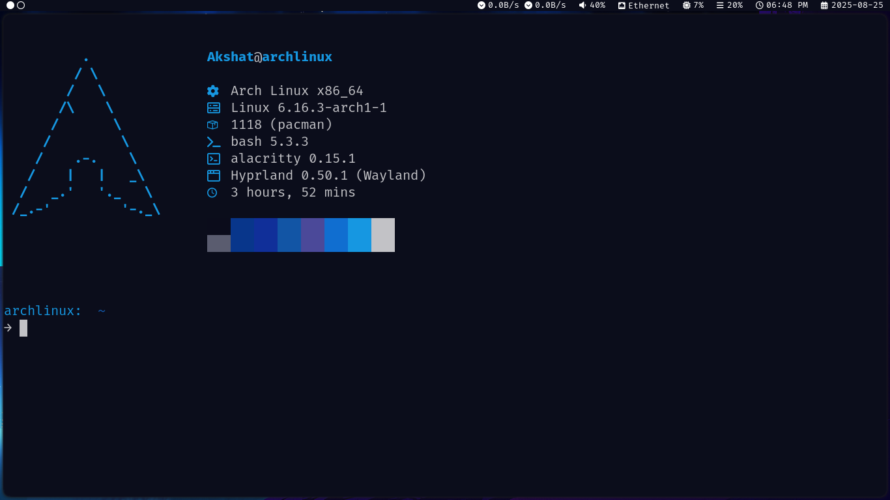

# My Hyprland Dotfiles for Hyprland

A personal collection of configuration files and setup scripts for my Arch Linux.
Primarily tested with **Hyprland**, but many configs (e.g. Neovim, Alacritty, bash) are desktop-agnostic.
The Hyprland RICE is a mix of Catppuccin Mocha and other Catppuccin themes.

## Screenshots





---

## Features

* **Window Managers / DE**

  * [Hyprland](https://github.com/hyprwm/Hyprland)

* **Terminal & Shell**

  * [Alacritty](https://github.com/alacritty/alacritty)
  * `.bashrc` customizations
  * [Fastfetch](https://github.com/fastfetch-cli/fastfetch)

* **Fonts used**

   * FiraCode Nerd Font(AUR)

* **System Utilities**

  * [btop](https://github.com/aristocratos/btop)
  * [htop](https://htop.dev/)
  * PulseAudio & pavucontrol configs
  * User directories & autostart scripts

* **UI Components**

  * [waybar](https://github.com/Alexays/Waybar)
  * [rofi](https://github.com/davatorium/rofi)
  * Swww for wallpaper
  * Pywal used for generating colors
  * GTK theme configuration

* **Editor**

  * Neovim with NvChad

* **Other**

  * Thunar file manager
  * Papirus icon pack with Catppuccin Mocha Blue flavor
  * Backgrounds and theme tweaks

---

## Installation

Clone this repository:

```bash
git clone https://github.com/akshatm1/Dotfiles.git ~/
```

## Applying Configs

### Approach using Bootstrap.sh

First, change the permission of bootstrap.sh if it's not an executable:

```bash
chmod +x ~/bootstrap.sh
```

Then, just run the script file and hope an error does not occur:

```bash
./bootstrap.sh
```

Here is the basic rundown of what packages bootstrap.sh will install if it's not installed on your system:

* OhMyBash
* base
* base-devel 
* networkmanager 
* bluez 
* bluez-utils 
* pipewire-alsa 
* pipewire-jack 
* pulseaudio 
* pavucontrol 
* wireplumber 
* git 
* github-cli 
* sudo 
* wget 
* curl 
* unzip 
* unrar 
* alacritty 
* thunar 
* firefox 
* evince 
* neovim 
* fastfetch 
* htop
* grim 
* wl-clipboard 
* xclip 
* tumbler 
* brightnessctl 
* pamixer
* hyprland-workspaces 
* waybar 
* rofi 
* swww 
* dunst 
* pywal 
* papirus-icon-theme 
* catppuccin-gtk-theme-mocha
* lxappearance 
* gtk-engine-murrine 
* aylurs-gtk-shell-git 
* bibata-cursor-theme-bin 
* ttf-fira-code 
* ttf-firacode-nerd 
* ttf-jetbrains-mono 
* ttf-dejavu-nerd 
* otf-font-awesome

Some are stupidly simple like base or base-devel but just to make sure, I added them as well.

After installing all these using pacman, yay(If yay doesn't exist, it will install it), or Git and then it will use stow to symlink every directory and file in their respective locations.

**NOTE:** I have removed hyprland-bin from bootstrap.sh because it caused problems when I was testing my script in a VM, please first refer to the original [Hyprland Wiki](https://wiki.hypr.land) website for instructions to install Hyprland before running the bootstrap script file.

### Outdated Approach

The caveman approach you can use is first backing up my current .config/ directory and .bashrc file if you have any:

```bash
mv ~/.config/ ~/.config_bak/
mv ~/.bashrc ~/.bashrc_bak
```

Then, to copy-paste configs to their respective location:

```bash
mv ~/Dotfiles/.bashrc ~/ 
mv ~/Dotfiles/wal ~/.cache
mv ~/Dotfiles ~/.config
``` 

Pretty useful if you have a clean install. I'll add Stow after I learn about it.

---

## Disclaimer

* Designed for personal use—your mileage may vary on other systems.
* Some configs assume Wayland (Hyprland).
* If you think this will be easy copy-pasting, please mentally prepare yourself for some crying over missing dependencies and screaming at your terminal(In your mind) :)
